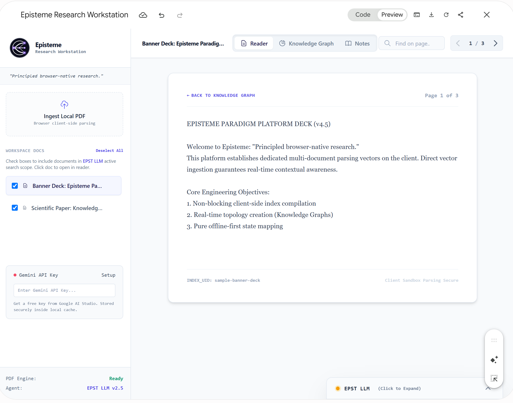

# 🔬 Episteme Research Workstation

> *"Principled browser-native research."*

**Episteme Research Workstation** is a client-side, zero-dependency scientific workspace that converts flat research PDFs into dynamic, interactive knowledge topographies and grounded AI insights powered by **EPST LLM** (Gemini 2.5 Flash).

## 📸 Application Screenshot

## ✨ Key Features

* **📄 Browser-Native PDF Ingestion**: Client-side text array tokenization via PDF.js with zero server uploads required.
* **🧠 Adaptive Topological Knowledge Graph**: An interactive, spring-physics coordinate engine (Coulomb repulsion & Hooke attraction) mapping document entity relationships in real-time.
* **🤖 EPST LLM Research Agent**: Dual-mode intelligent assistant built on Google's Gemini 2.5 Flash API:
  * *Grounded Context Scope*: Precise page-level and multi-document cross-referencing citations.
  * *Agentic General Scope*: Seamless fallback for complex scientific, math, and code inquiries.
* **⚡ Dynamic Entity Extraction**: Auto-compile structured entity-relationship nodes directly from active paper pages.
* **📝 Citation Clipper & Scratchpad**: Floating text highlight badge to capture instant annotations into an editable Markdown notepad with 1-click `.md` export.

## 🛠️ Tech Stack

* **Frontend Framework**: React 18 (Browser Standalone / UMD)
* **Styling**: Tailwind CSS CDN
* **PDF Parser**: PDF.js (`pdf.min.js` worker)
* **AI Model**: Google Gemini 2.5 Flash API
* **Graph Engine**: Native SVG Force Simulation
* **Transpiler**: Babel Standalone

🚀 Quick Local Setup

Since Episteme Workstation is self-contained in a single file, running it locally requires no installation:

Clone or download this repository:

git clone https://github.com/Ambili-Jayan/episteme-workstation.git

Open index.html directly in any modern browser (Chrome, Edge, Firefox, Safari).

Open the left sidebar, click Gemini API Key -> Setup, and paste your Google AI Studio API key.

☁️ Deployment

This project is ready to deploy live on Vercel.
[episteme-workstation-git-main-ambili.vercel.app](https://episteme-workstation-git-main-ambili.vercel.app/)

📜 License

Distributed under the MIT License. See LICENSE for more information.
